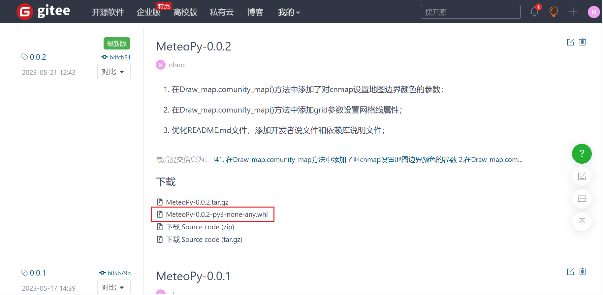
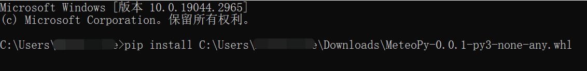
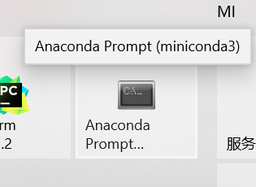
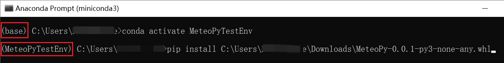

# MeteoPy库如何安装

1. 首先进入本函数库的开源官网：https://gitee.com/MeteoTop/MeteoPy；

2. 在右侧栏找到“发行版”标签，点击进入发行版；

   

3. 选择你所需要下载的版本，点击对应版本下载`.whl`文件；

   

4. 本地安装MeteoPy库；

   + 如果像直接将MeteoPy库安装到本地的主python环境中，则打开cmd命令行，`pip install + 刚刚下载的whl文件地址`；

     

   + 如果想安装在conda的某个虚拟环境中，则先打开`Anaconda Prompt`，然后进入目标虚拟环境`conda activate **`，最后再`pip install + 刚刚下载的whl文件地址`;

     

     

     

**注意：不要，不要，不要**

**不要直接`pip install MeteoPy`，因为在PyPI官网上有同名函数，所有直接下载的并不是此MetetoPy库**

